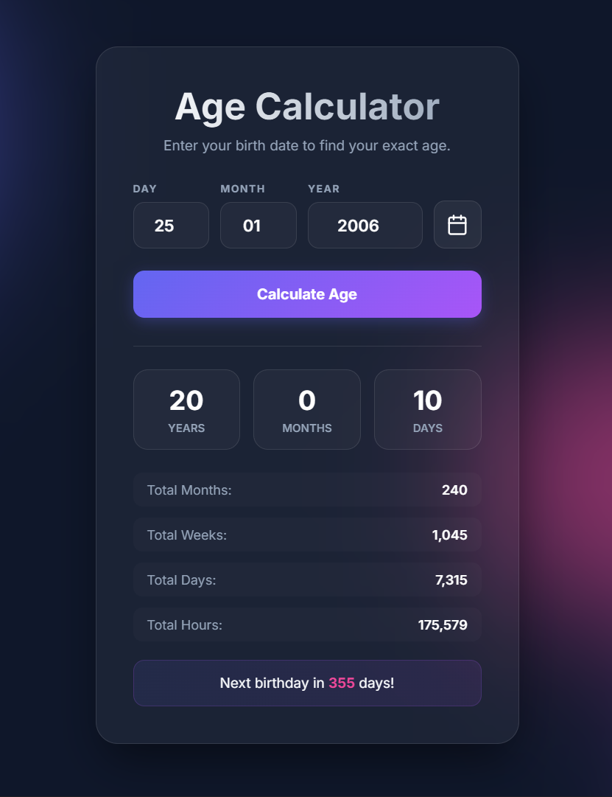

# ✨ Modern Age Calculator

A premium, glassmorphic Age Calculator built with modern web technologies. This application provides a high-end user experience with smooth animations, dynamic background blobs, and a sequential calendar selection flow.

|                        App Preview                        |
| :-------------------------------------------------------: |
|  |

<p align="center">
  <a href="Paste hear" target="_blank">
    
  </a>
</p>

## 🚀 Features

- **💎 Premium Design**: Sleek glassmorphic interface with frosted glass effects and glowing borders.
- **📅 Smart Calendar**: Custom Year-first selection flow for ultra-fast date picking.
- **📱 Responsive Layout**: Fully optimized for Desktop, Tablet, and Mobile devices.
- **⚡ Real-time Results**: Instant calculation of age across multiple time units (Years, Months, Days, Weeks, Hours).
- **🎨 Animated UI**: Dynamic background blobs and smooth CSS transitions for a "living" interface.
- **🔒 Privacy First**: All calculations happen locally in your browser.

## 🛠️ Built With

- **HTML5**: Semantic structure for accessibility and SEO.
- **Vanilla CSS**: Custom styling with HSL color tokens and CSS variables.
- **JavaScript (ES6+)**: Custom age calculation algorithm and interactive UI logic.
- **Google Fonts**: "Inter" for modern typography.

## 📂 Project Structure

```text
├── assets/
│   ├── css/
│   │   └── style.css      # Core styles and design system
│   ├── js/
│   │   └── script.js     # Component logic and calendar engine
│   └── images/            # UI assets and screenshots
├── index.html             # Main entry point
└── README.md              # Project documentation
```

## 🏁 Getting Started

1.  **Clone the repository**:
    ```bash
    git clone https://github.com/your-username/age-calculator.git
    ```
2.  **Open the project**:
    Simply open `index.html` in any modern web browser.

## 📝 How to Use

1.  Click the **Calendar Icon** to open the premium picker.
2.  Select your **Year** (scroll to find yours), then **Month**, and finally the **Date**.
3.  Or type directly into the input boxes.
4.  Hit **Enter** or click **Calculate Age** to see your lifetime stats!

---

_Handcrafted with ❤️ by Antigravity_
